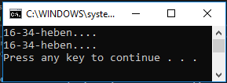
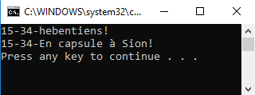

# EncaspuleMe

Auteur : Nicolas Glassey

Ce projet "challenge" permet de revoir les principes d'encapsulation.

## Comment débuter

Il vous suffit de cloner le dépôt, de compiler et de lancer le projet en mode "sans debug" (Ctrl+F5)

## Résultat au début du challenge

## Résultat à la fin du challenge

## Contraintes

* Seule la classe "Ouf" peut être modifiée
* Les principes d'encapsulation doivent être respectés

## Mot de la fin

Bonne chance ;)